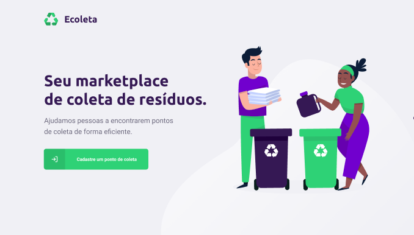
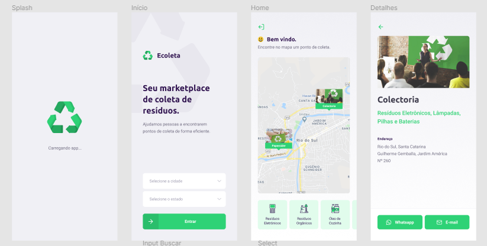

<h1 align="center">Ecoleta 🌱</h1>

Este projeto tem como finalidade achar pontos de descarte consciente de resíduos recicláveis.
É um projeto proposto pela Rocketseat onde o nome do evento é NLW -> Next Level Week, e desenvolvido em uma semana com aulas ministradas pelo Diego Fernandes.

  
  
  
  

<h2>ℹ️ O que há na Next Level Week?</h2>

O NLW é uma semana prática com muito código, desafios, redes e um único objetivo: levá-lo ao próximo nível. Através do nosso método, você aprenderá novas ferramentas, aprenderá sobre novas tecnologias e descobrirá hacks que irão impulsionar sua carreira. Um evento online e totalmente gratuito que o ajudará a dar o próximo passo na sua evolução como desenvolvedor.

<h2>Dias</h2>
<ul>
  <li>Dia 1: Acelerando sua evolução 01/06 - ✔️</li>
  <li>Dia 2: Olhando para as oportunidades 02/06 - ✔️</li>
  <li>Dia 3: A escolha da Stack 03/06 - ✔️</li>
  <li>Dia 4: Até 2 anos em 2 meses 04/06 - ✔️</li>
  <li>Dia 5: Milha extra 05/06 - ✔️</li>
</ul>

<h2>💻 Projeto</h2>

Ecoleta é um projeto desenvolvido com base na semana internacional do meio ambiente. O objetivo é conectar pessoas a empresas que coletam resíduos específicos, como lâmpadas, baterias, óleo de cozinha etc.

    

<h2>🚀 Tecnologias</h2>
<ul>
  <li><a href="https://nodejs.org/en/">Node.js</a></li>
  <li><a href="https://github.com/microsoft/TypeScript">TypeScript</a></li>
  <li><a href="https://github.com/facebook/react">ReactJS</a></li>
  <li><a href="https://github.com/facebook/react-native">React Native</a></li>
  <li><a href="https://github.com/expo/expo">Expo</a></li>
</ul>

<h2>🔖 Layout</h2>
Layout da aplicação web e mobile disponível no: <a href="https://www.figma.com/file/1SxgOMojOB2zYT0Mdk28lB/Ecoleta?node-id=0%3A1">Figma</a>

<h2>ℹ️ Como usar o server?</h2>
O projeto do server está disponível clicando aqui: <a href="https://github.com/miguelrisquelme/Ecoleta_BackEnd">Link</a>

Após baixado basta apenas seguir esses passos:

1. Entre na pasta /server
2. Executar o comando: `npm run dev`
3. Executar o comando para gerar o banco: `npm run knex:migrate`
4. Executar o comando para add seeds ao banco: `npm run knex:seed`
5. Após instaladas as depêndencias dar: `npm start`

Feito isso vai estar rodando no **localhost:3333**

<h2>ℹ️ Como usar a aplicação web?</h2>

    

**É IMPORTANTE QUE O SERVER ESTEJA RODANDO**

1. Baixa o repositório por este link: <a href="https://github.com/miguelrisquelme/Ecoleta_FrontEnd">Link</a>
2. Entre na pasta /web
3. Execute o comando: `npm i`
4. Após instaladas as depêndencias dê este comando: `npm start`
5. Espere que irá abrir a aba no seu navegador padrão!

<h2>ℹ️ Como usar o app??</h2>

    

**É IMPORTANTE QUE O SERVER ESTEJA RODANDO E TENHA PONTOS CADASTRADOS JÁ**
*Em breve eu gero a apk e deixo disponível no repositório*

1. Antes de tudo você precisa ter o <a href="https://github.com/expo/expo">Expo</a> instalado, dá esse comando: `npm install -g expo-cli`
2. Após instalado baixe o projeto do app neste link: <a href="https://github.com/miguelrisquelme/Ecoleta_Mobile">Link</a>
3. Baixou?? Então boraa. Próximo etapa é instalar os pacotes, basta dar esse comando dentro da pasta /mobile: `npm i`
4. Instalado, basta ainda dentro da pasta /mobile dar o comando: `npm start` ou `expo start`
5. Com o seu Smartphone conectado via USB e com depuração USB ativada é só esperar que em breve o aplicativo vai estar rodando :)
